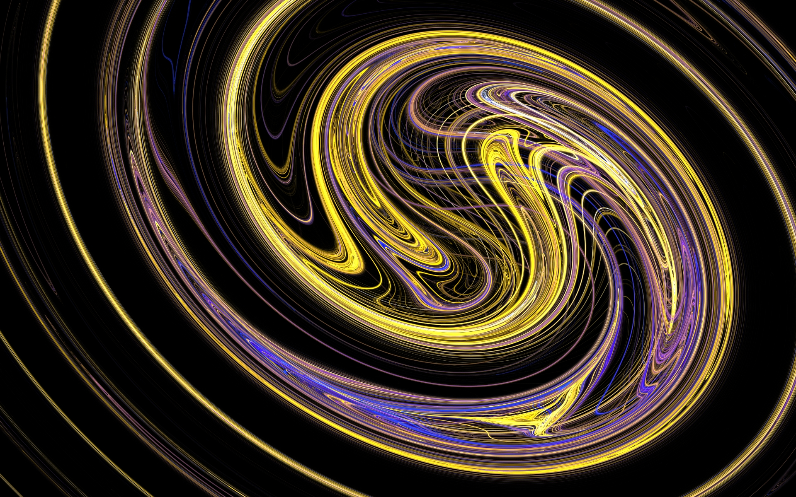
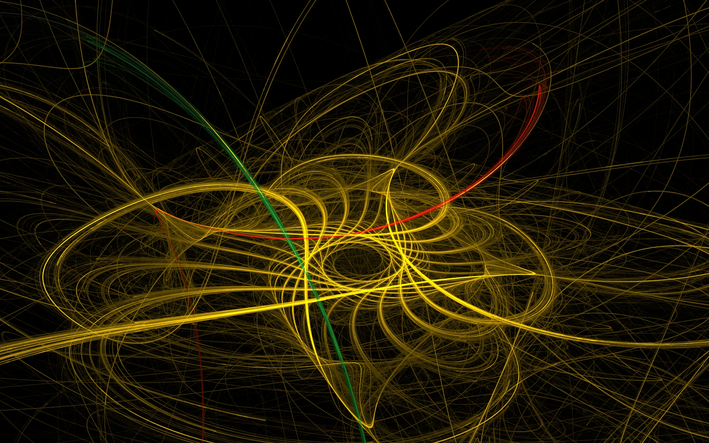
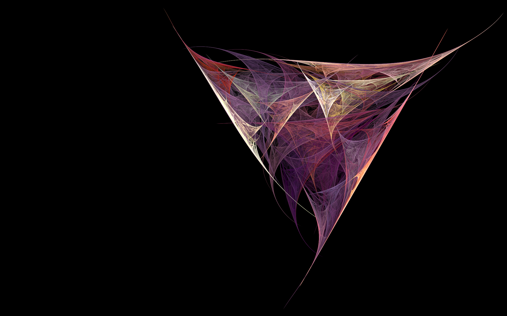
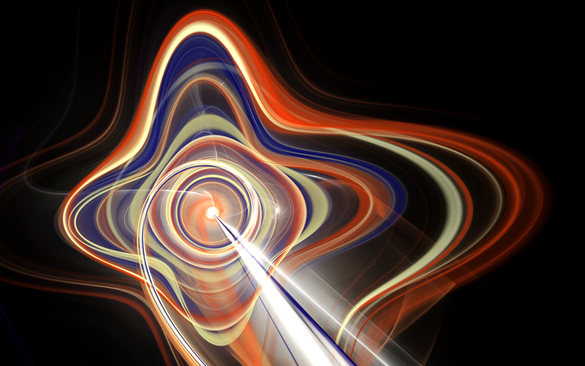
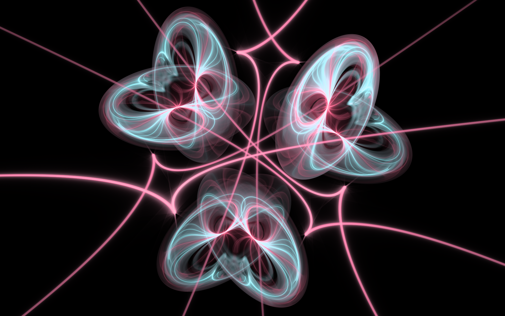
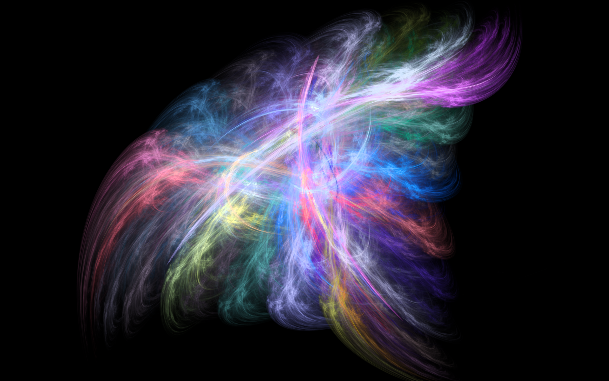
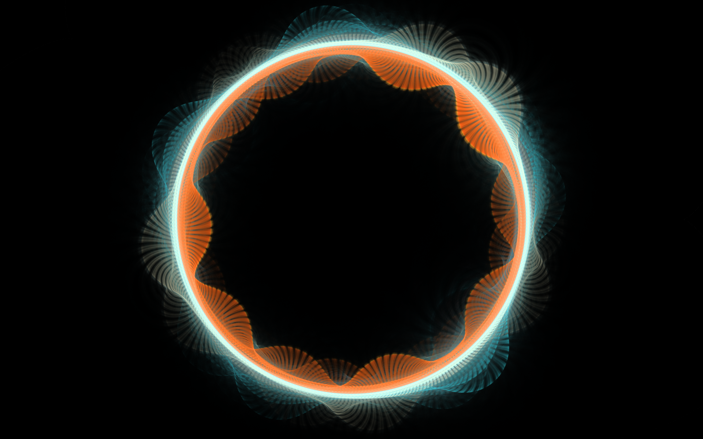
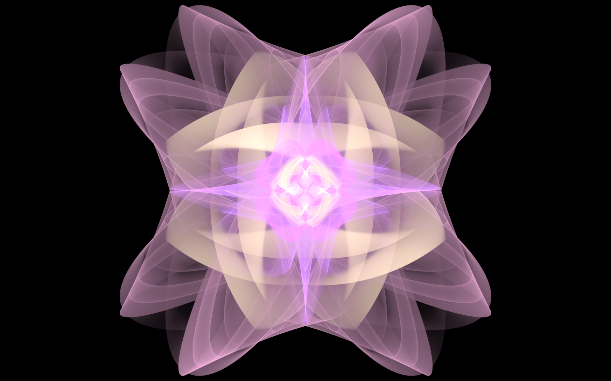
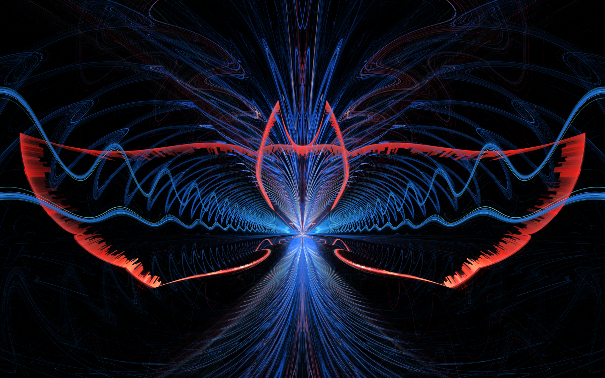

# Art

This is a collection of some of the better fractal flame images I've made.

 

I started making them back in 2013 using Apophysis7x.

Recently, I've gotten back into making fractals using Fractorium. With OpenCL support, it's many times faster and easier to use.

Most of my images were originally 1920x1200. Most have been rerendered at 1440p and I would like to eventually rerender everything at 4k. Due to software limitations, there is some manual work required to reframe the images when doing a render at new resolution. 

I also have some phone wallpapers in a dedicated folder. Sadly cellphone resolutions vary wildly across models/brands so I've just chucked whatever I had rendered for my personal use.

The works contained in this repo are licensed under CC BY-NC-SA 4.0. To view a copy of this license, visit https://creativecommons.org/licenses/by-nc-sa/4.0

