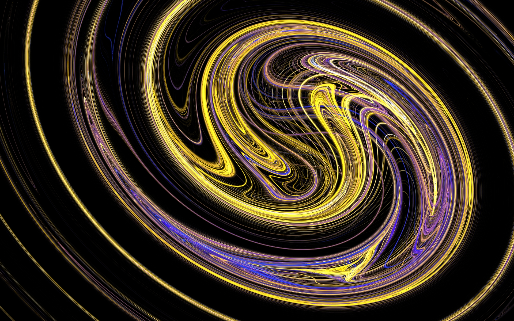
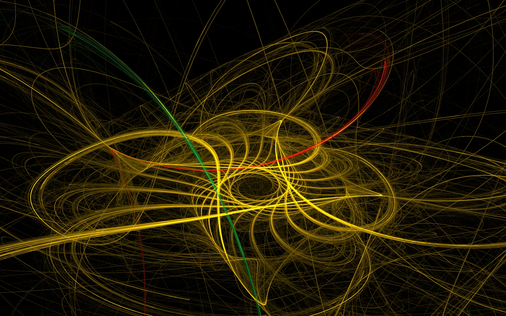
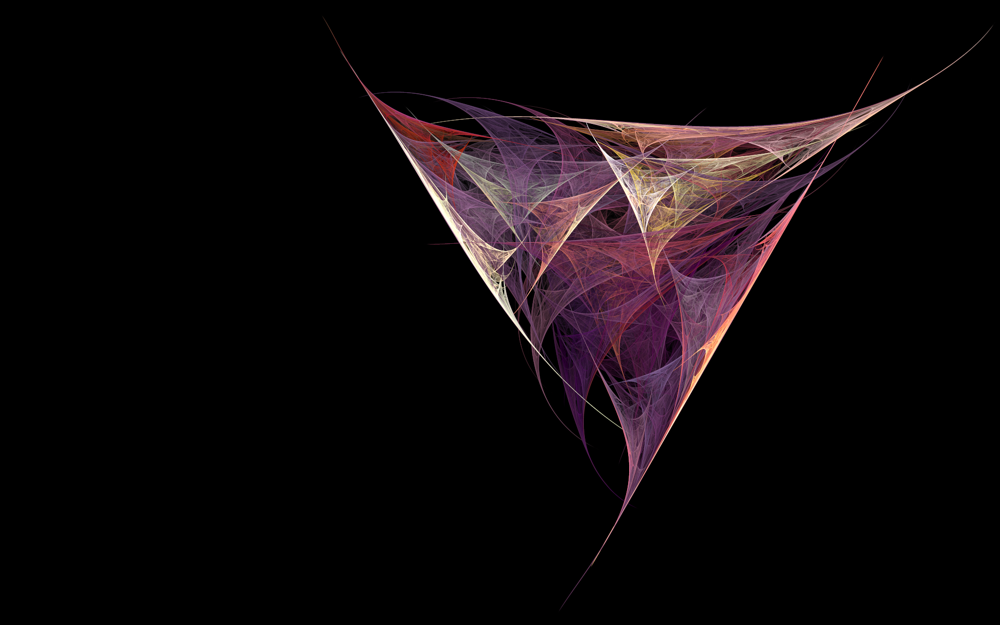
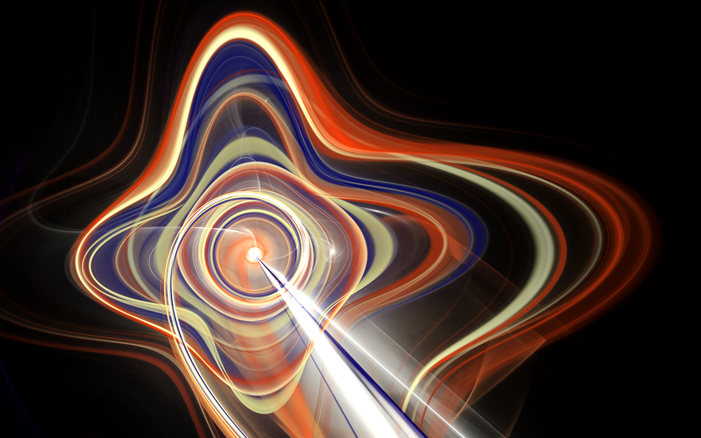
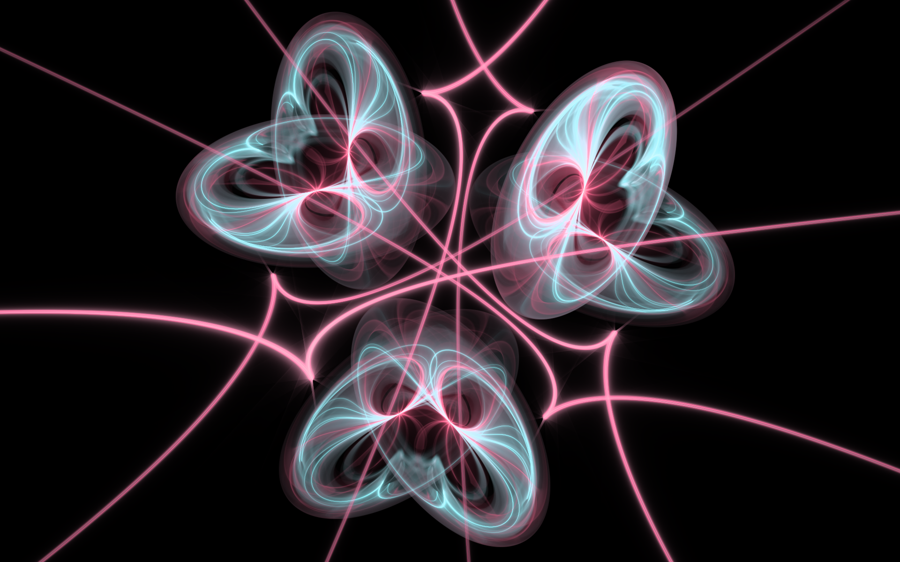
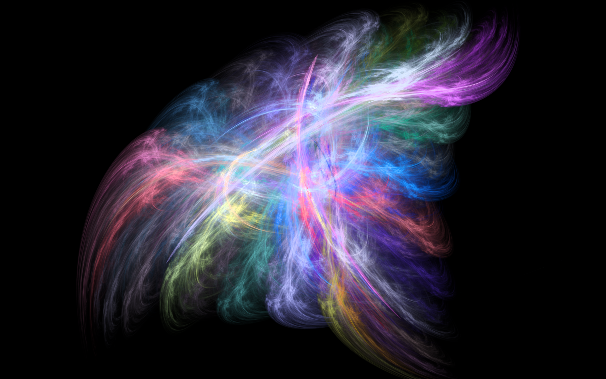

# Art

This is a collection of some of the better fractal flame images I've made.

 

I started making them back in 2013 using Apophysis7x.

Recently, I've gotten back into making fractals using Fractorium. With OpenCL support, it's many times faster and easier to use.

Most of my images are 1920x1200.

The works contained in this repo are licensed under CC BY-NC-SA 4.0. To view a copy of this license, visit https://creativecommons.org/licenses/by-nc-sa/4.0

